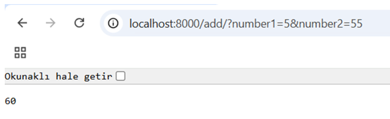

# Week 5 — FastAPI Sum API

This project is a minimal FastAPI application that receives two integers via query parameters
and returns their sum.

## Requirements
- Python 3.10+ recommended
- fastapi
- uvicorn

## Setup (Windows / PowerShell)

Create and activate a virtual environment:

```powershell
python -m venv .venv
.\.venv\Scripts\Activate.ps1

## Example Response
Below is an example response from the API when calling:



