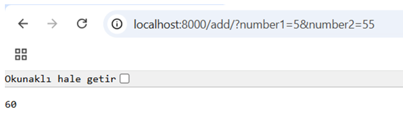

# Week 5 — FastAPI Sum API

This project is a minimal FastAPI application developed as part of the MLOps & LLMOps Bootcamp.  
The purpose of this assignment is to understand the basic structure of a FastAPI backend, request handling, and API testing using Swagger UI.

The API receives two integer values as query parameters and returns their sum.

---

## Objectives

- Learn FastAPI project structure
- Create a simple REST endpoint
- Handle query parameters
- Run an API server locally
- Test endpoints using Swagger UI

---

## Requirements

- Python 3.10 or higher
- fastapi
- uvicorn

---

## Project Structure

```text
week5-fastapi-sum-api/
│
├── main.py
├── requirements.txt
├── screenshots/
│   └── fastapi_sum_result.png
└── README.md
```

## Installation & Setup (Windows / PowerShell)
### 1. Create virtual environment
 
python -m venv .venv

### 2. Activate environment

.\.venv\Scripts\Activate.ps1

### 3. Install dependencies

pip install -r requirements.txt

### Running the API
Start the FastAPI server with:

uvicorn main:app --reload


The application will run at:

http://127.0.0.1:8000

Swagger UI is available at:

http://127.0.0.1:8000/docs

### API Endpoint
### GET /sum

Calculates the sum of two integers.

### Query Parameters

### Parameter 	Type	   Description
       a	       int	   First number
       b	       int     Second number

### Example Request

http://127.0.0.1:8000/sum?a=5&b=7

### Example Response

{
  "result": 12
}

## Screenshot

Below is an example response captured from Swagger UI:




---

## Summary

In this assignment, the following concepts were practiced:

* FastAPI application initialization

* Query parameter handling

* Endpoint creation

* Local API execution

* Swagger-based API testing

This project provides the foundation for later weeks where authentication, databases, and machine learning models are integrated into FastAPI services.

---

## Author

**Tuğba Niksarlı**

**MLOps & LLMOps Bootcamp Participant**
